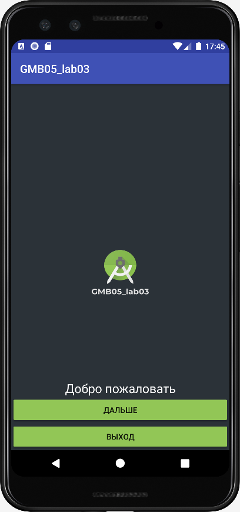
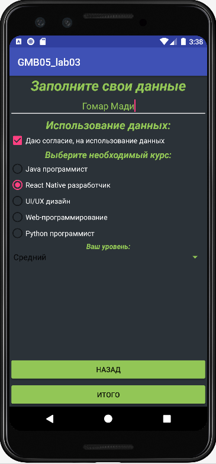
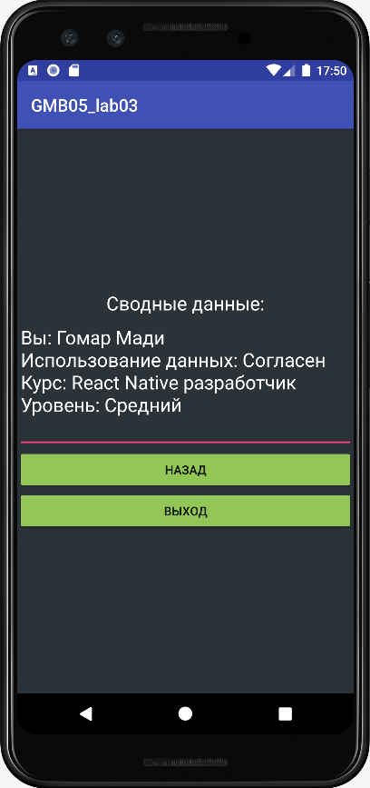

# GMB05_lab03_AndroidStudio
Practical work 3. In the discipline of Mobile application development





МЕТОД ДЛЯ КНОПКИ "ИТОГО"
```
public void onInfo(View v) {
        Intent intent = new Intent(MainActivity.this, ResultActivity.class);
        
        selectRadioButton = findViewById(radioGroup.getCheckedRadioButtonId());
        
        intent.putExtra("fio", editText.getText().toString());
        intent.putExtra("data", checkBox.isChecked() ? getString(R.string.YES) : getString(R.string.NO));
        intent.putExtra("cource", selectRadioButton.getText());
        intent.putExtra("level", spinner.getSelectedItem().toString());

        startActivity(intent);
    }
```


Teacher: https://github.com/proffix4
